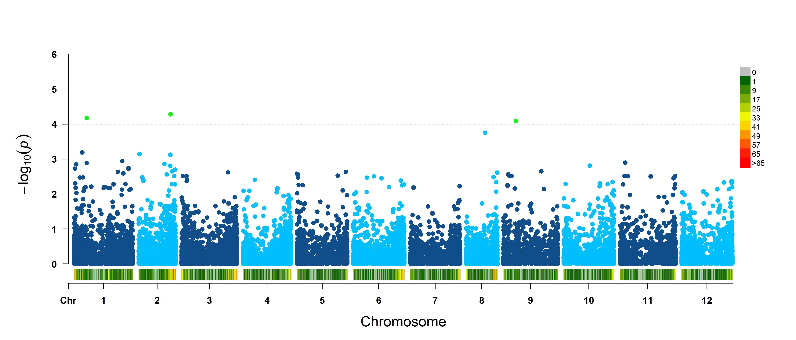

```{r setup, include=FALSE}
packages <- c("htmltools", "knitr", "tidyverse", "here",
              "fontawesome", "gadenbuie/tweetrmd",
              "readxl", "pacman", "skimr",# general use functions
                "dartR", "vcfR", 
                "janitor", "rMVP", "CMplot")
pak::pak(packages, ask=FALSE)
here::i_am("GWAS_analysis/GWAS_analysis.Rmd")

pacman::p_load(char = basename(packages), install = FALSE)

# pacman::p_load_gh("mitchelloharawild/icons", update = FALSE)
knitr::opts_chunk$set(echo = TRUE, fig.align='center', warning = FALSE)
```

```{js logo-js, echo=FALSE}
$(document).ready(function() {
  $('#header').parent().prepend('<div id=\"Griffith logo\"></div>');
  $('#header').css('margin-right', '120px')
});
```

# Intorduction
This lesson will focus on importing and processing of phenotypic and genomic data and performing trait-marker association analysis, as part of the Sensory and Genomics Data Analysis Workshop.  We will use chili disease resistance data as an example (kindly provided by Dr Wassana Kethom from Department of Horticulture, Faculty of Agriculture at Kamphaeng Saen, Kasetsart University, Thailand).

## Analysis Workflow

### Install Packages
R can be extended with additional functionality by installing external packages (usually hosted at the Comprehensive R Archive Network repository -- [CRAN](https://cran.r-project.org/web/packages/index.html){target="_blank"}). To find which packages can be useful for your type analysis, use your favorite search engine (Google is your friend) and the available [Task Views on CRAN](https://cran.r-project.org/web/views/){target="_blank"}, which provide some guidance which packages on CRAN are relevant for tasks related to a certain topic.  
For our current analysis we will use some packages from the [tidyverse](https://www.tidyverse.org/){target="_blank"} -- a suite of packages designed to assist in data analysis, from reading data from multiple source (`readr`, `readxl` packages), through data wrangling and cleanup (such as `dplyr`, `tidyr`) and visualisation (`ggplot2`). In addition, we will use other packages for data cleanup (`janitor`) and summary (`skimr`), genomic files processing (`dartR`, `vcfR`, `SNPfiltR`, `adegenet`) and GWAS analysis (`rMVP`, `GAPIT`, `CMplot`) .

To install these packages, we use the `install.packages('package')` command, please note that the package name need to be quoted and that we only need to be perform it once, or when we want or need to update the package.  Once the package was installed, we can load its functions using the `library(package)` command. _Note that in this case we use the package name without quotes!_.  
Installing and loading more than a handful of packages from different sources (CRAN, GitHub, BioConductor) can become daunting and time-consuming using the general approach described above, however, with [pak](https://pak.r-lib.org/){target="_blank"} and [pacman](https://github.com/trinker/pacman){target="_blank"} we can easily install and load multiple packages in a couple lines of code, so we will use it throughout these workshops.


```{r install_packages, eval=FALSE}
# install pak - needed only once! (comment with a # after first use)
install.packages("pak")
# load the package
library(pak)
required_packages <- c("tidyverse", "janitor", "readxl", "pacman", "skimr",# general use functions
                       "dartR", "vcfR", "SNPfiltR","rMVP", "CMplot" # genomic and GWAS tools
                       )
# install all packages - needed only once! (comment with a # after first use)
pak(required_packages)  
# load all packages at once with pacman - required at the begining of every session
pacman::p_load(char = basename(required_packages), update = FALSE)

```

Now we have R and RStudio set up and ready to read in data and do some analysis!

### Phenotypic Data 
The first step in the analysis is reading the phenotypic, or trait information for each individual and perform basic exploratory analysis and QC of each trait.


```{r chili-pheno}
# get the names of the sheets in the Excel file
pheno_sheets <- excel_sheets("data/chili_phenotypes.xlsx") %>% 
  .[!grepl("sqrt", ., ignore.case = TRUE)]
# Anthracnose sheets
anthracnose_sheets <- grep("anthracnose.+_green",  pheno_sheets, perl = TRUE,
                           ignore.case = TRUE, value = TRUE)
# read the sheet into a data frame
pheno_sheet <- anthracnose_sheets[1] # "AnthracnoseMJ5_green"

pheno_data <- read_excel("data/chili_phenotypes.xlsx", pheno_sheet, na = c("", "-")) %>% 
  clean_names() %>% rename(ind=acc) %>% mutate(acc=sub("_.+", "", ind))

```

### Genomic Data
The genomic data that we will use in this workshop contains SNPs generated by Diversity Array Technologies ([DArTSeq](https://www.diversityarrays.com/services/dartseq/), Canberra).  
The first step will be to import the data (as a `genlight` object) and assess the level of "missingness" (missing genotype calls across individuals and loci) with the [dartR package](https://green-striped-gecko.github.io/dartR/) [@gruberDartRPackageFacilitate2018].

```{r read-geno-data}
# unzip DArT file
# unzip("data/Report_DCap21-5983_2_moreOrders_SNP_2.zip", exdir = "data", junkpaths = TRUE)
# # import DArT file as genlight object
# gl <- gl.read.dart(filename="data/Report_DCap21-5983_2_moreOrders_SNP_2.csv")
# save to disk
# save(gl, file = "data/chili_geno_data.Rdata")
load("data/chili_geno_data.Rdata")
```

Generate callrate report for loci (based on the first 1000 SNPs):

```{r loc-callrate}
gl.report.callrate(gl, verbose = 3, plot.out = FALSE)
```

Generate read depth report for loci (based on the first 1000 SNPs):

``` {r loc-depth}
gl.report.rdepth(gl, verbose = 3)
```

Now we can filter the genotype data based on some thresholds

```{r geno-filter}
# remove tags/loci with too many SNPs - indicate regions of sequencing errors (repeats)
max_snps_in_tag <- 5
drop_tags <- gl@other$loc.metrics %>% count(CloneID) %>% filter(n>max_snps_in_tag)
drop_loci <- grep(paste(drop_tags$CloneID, collapse = "-|"),
                  locNames(gl),
                  perl = TRUE, value = TRUE)
# filter SNP quality

glsub <- gl %>% gl.compliance.check() %>%
  gl.drop.loc(drop_loci, verbose = 3) %>% # drop multi-SNP loci/tags
  gl.filter.reproducibility(threshold = 0.99, verbose = 3, plot.out = FALSE) %>% # remove non-reproducible loci
  gl.filter.secondaries(method = "best", verbose = 3) %>% # remove secondary SNPs (select best in each loci)
  gl.filter.rdepth(testset.gl, lower=5, upper=100, verbose=3, plot.out = FALSE) %>% # remove low-depth loci
  gl.filter.callrate(method = "loc", threshold = 0.8, mono.rm = TRUE, recalc = TRUE, 
                     verbose = 3, plot.out = FALSE) %>% # filter loc callrate 
  gl.filter.callrate(method = "ind", mono.rm = TRUE,threshold = 0.2, recalc = TRUE, 
                     verbose = 3, plot.out = FALSE) # filter ind callrate

```

### GWAS analysis
#### Prepare input files
The next step is preparing the input data for the GWAS analysis, which includes:

1. Combine and filter the morphological data and genotype data to make sure they include the same individuals.
2. Recode the genotypes as numbers (see these instructions)
3. Generate a genetic map with chromosomal coordinates for the markers (from the DArT data)

```{r gwas-prep-metadata}
# assign "population" metadata information
metadata <- read_excel("data/chili_phenotypes.xlsx", sheet = "Morphological", na = c("", "-")) %>% 
  clean_names() %>% 
  select(acc, scientific_name, country) %>% 
  mutate(pop=factor(scientific_name))
# change individual names to match the phenotypic data
indNames(glsub) <- indNames(glsub) %>%  sub("-", "_", ., fixed = TRUE) %>% 
  sub("(^\\d+)", "CA\\1", .)
pop_table <- tibble(ind=indNames(glsub)) %>% 
  left_join(pheno_data %>% select(ind, acc)) %>% 
  left_join(metadata)

pop_table %>% count(scientific_name)
# assign "population" to the filtered genlight object
pop(glsub) <- pop_table$pop

```

```{r gwas-prep-data}
# subset the genotypes table (and filter for MAF)
MAF_thresh=0.01
gl_morpho <- glsub %>% 
  gl.keep.ind(pheno_data$ind, recalc = TRUE, mono.rm = TRUE, verbose = 3) %>% 
  gl.filter.maf(threshold = MAF_thresh, recalc = TRUE, verbose = 3, plot.out = FALSE)
# make sure that we retain all the individuals 
keep_acc <- pheno_data$ind %in% indNames(gl_morpho)
table(keep_acc)
morpho_data <- pheno_data %>% 
  filter(keep_acc) %>% select(ind, "percent_lfa") %>% 
  mutate(sqrt_lfa=sqrt(percent_lfa)) %>% 
  as.data.frame()

MVP.Hist(phe=morpho_data, outpath="plots", breakNum=20, dpi=300, 
         test.method = "auto")

# convert genotypic data to genetic map
gm_morpho <- gl_morpho$other$loc.metrics %>% as_tibble() %>% 
  mutate(snp_id=locNames(gl_morpho),
         chrom = as.integer(sub("Pepper.v.1.55.chr", "", Chrom_Capsicum_v155)),
         snp_pos=ChromPos_Capsicum_v155 + SnpPosition) %>% 
  dplyr::select(snp_id, chrom, snp_pos) %>% filter(chrom!="") %>% 
  arrange(chrom, snp_pos)
# check how many SNPs from each chromosome (and missing)
gm_morpho %>% count(chrom)

# convert genotypic data to numeric format (and impute missing genotypes)
gl_num <- gl_morpho %>% gl.keep.loc(gm_morpho$snp_id) %>% 
  gl.impute(method="neighbour") %>% 
  tab(NA.method="asis") %>% t() %>% as.big.matrix() 
  
  

```

#### Run the GWAS analysis

We will perform with the `rMVP` package [@yinRMVPMemoryefficientVisualizationenhanced2021]. 

```{r gwas-mvp}
phenotype <- morpho_data %>% dplyr::select(ind, percent_lfa)
dir.create("rMVP_results")
imMVP <- MVP(
    phe=phenotype,
    geno=gl_num,
    map=gm_morpho,
    #K=Kinship,
    #CV.GLM=Covariates,  ##if you have additional covariates, please keep there open.
    #CV.MLM=Covariates,
    #CV.FarmCPU=Covariates,
    # nPC.GLM=5,   ##if you have added PCs into covariates, please keep there closed.
    # nPC.MLM=3,  ##if you don't want to add PCs as covariates, please comment out the parameters instead of setting the nPC to 0.
    # nPC.FarmCPU=3,
    priority="speed",   ##for Kinship construction
    #ncpus=10,
    vc.method="BRENT",  ##only works for MLM
    maxLoop=10,
    method.bin="static",   ## "FaST-LMM", "static" (#only works for FarmCPU)
    #permutation.threshold=TRUE,
    #permutation.rep=100,
    threshold=0.1,
    
    method=c("GLM", "MLM", "FarmCPU"),
    outpath = "rMVP_results",
    file.output=c("pmap", "pmap.signal", "plot", "log")
)

```

Create Manhattan plot and highlight significant SNPs

```{r mj5-green-mlm-plot}
MVP.Report(imMVP, plot.type="m", col=c("dodgerblue4","deepskyblue"), LOG10=TRUE, ylim=NULL,
        threshold=c(1e-6,1e-4), threshold.lty=c(1,2), threshold.lwd=c(1,1), threshold.col=c("black",
        "grey"), amplify=TRUE,chr.den.col=c("darkgreen", "yellow", "red"), signal.col=c("red","green"), signal.cex=c(1,1),
        signal.pch=c(19,19), 
        outpath = "rMVP_results",  file.output = TRUE, memo = "chili_MJ5_green",
        file.type="jpg",dpi=300)
imMVP$mlm.results %>% as_tibble() %>% bind_cols(imMVP$map) %>% filter(-log10(percent_lfa.MLM)>4)
```


```{r rmvp-chili-anthrac, echo=FALSE, fig.cap="Manhattan plot of SNP association with Anthracnose resistance in green chili, as determined by MLM analysis (performed with rMVP)", out.width = '80%'}
# knitr::include_graphics(here("figs", "feature_engineering.png"))

```

Note that similar analysis can be done with other tools, such as `GAPIT`, `hibayes`, `ASReml-R` and others which implement similar and additional algorithms [@wangGAPITVersionBoosting2021a; @yinHibayesPackageFit2022].

## Additional Resources


### Using R and RStudio from Cloud services
If we want to keep things simple (for this workshop for example) or we would like to use R on shared computers, where we can't install software, we can run R and Rstudio through a web client that is hosted on a remote server.  
We will use the [Binder](https://mybinder.org/){target="_blank"} service, which is free, easy to use and can be launched from a single GitHub repository (more about this in the workshop).  
R and RStudio can also be run on [EcoCloud](https://ecocloud.org.au/){target="_blank"}, another cloud-based service free for researchers and oriented at ecology modeling and integration of external databases; or at [Rstudio.cloud](https://rstudio.cloud){target="_blank"}, which has a tiered subscription-based access (see [plans](https://rstudio.cloud/plans/compare){target="_blank"})

#### Running R and RStudio on Binder
Using Binder is as simple as clicking on the Binder badge - [{width=125px}](https://mybinder.org/v2/gh/IdoBar/Sensory_Genetics_training_binder/main?urlpath=rstudio){target="_blank"}.  
Alternatively, you can navigate to the [Binder](https://mybinder.org/){target="_blank"} homepage and enter the URL of this tutorial's [GitHub repository](https://github.com/IdoBar/Sensory_Genetics_training_binder.git){target="_blank"} `https://github.com/IdoBar/Sensory_Genetics_training_binder.git` and click on the **launch** button (see screenshot in Figure \@ref(fig:binder) below).
 
```{r binder, echo=FALSE, fig.cap="Binder launch screenshot.", out.width = '100%'}
knitr::include_graphics(here("figs",  "Screenshot_The_Binder_Project.png"))
```

Now be patient while the environment is loading...  
You should now see in your web browser an RStudio interface (if you got to the Jupyter page, click on new --> RStudio) and are ready to start working in R in "The Cloud"! `r  fa("cloud", fill ="#5599FF")``r  fa("cloud", fill ="#5599FF")``r  fa("cloud", fill ="#5599FF")`

##### Downloading files from Binder
After we've finished working on Binder we would like to download the R script that we wrote and any output files (summary tables and figures). We can access those files by using the `files` tab in RStudio (bottom right pane).  
Select the files/folders that you would like to download and click on `r  fa("cog", fill ="#4383A4")` More `r fa("long-arrow-alt-right")` Export... (see screenshot in Figure \@ref(fig:binder-export) below) to save the file on your computer.  

```{r binder-export, echo=FALSE, fig.cap="Download files from Binder/RStudio screenshot.", out.width = '75%'}
knitr::include_graphics(here("figs", "Rstudio_export_screenshot.png"))
```


### Online Books, Tutorials and Blogs

* **SNP filtering tutorial** -- Learn the principles behind proper filtering [link](https://www.ddocent.com/filtering/){target="_blank"}  
* **SNPfiltR** -- An R package for VCF file filtering and QC in R [GitHub repository](https://github.com/DevonDeRaad/SNPfiltR){target="_blank"}
* **Population genetics and genomics in R** -- A great tutorial from the creators of `vcfR` package [online tutorial](https://grunwaldlab.github.io/Population_Genetics_in_R/index.html){target="_blank"}


How good was that? Who needs Excel anyway `r emo::ji("wink")`?
```{r R-excel-meme}
tweetrmd::tweet_embed("https://twitter.com/IsabelCabreraR/status/1503407817583067139")
```

Please contact me at i.bar@griffith.edu.au if you have any questions or comments.

## References
